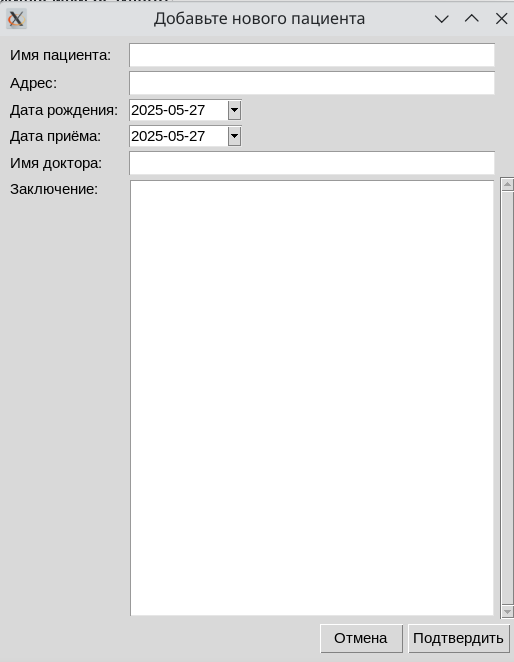
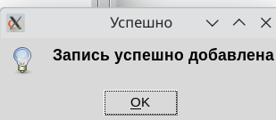
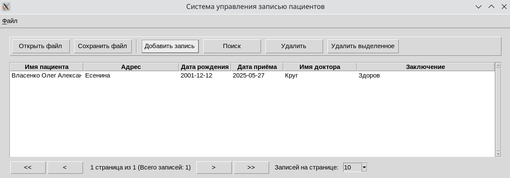
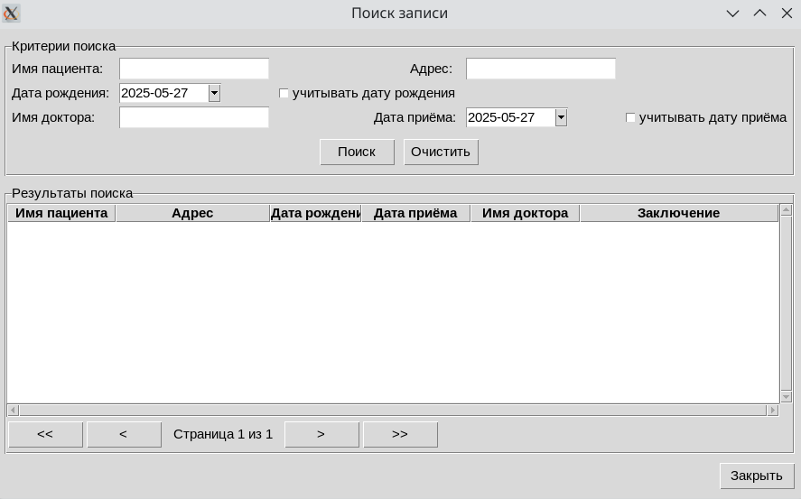
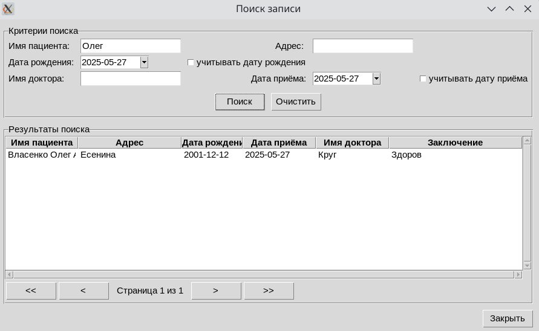
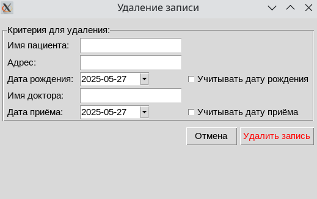
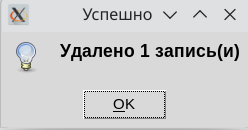
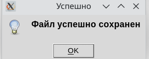
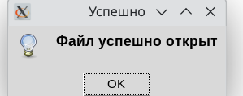
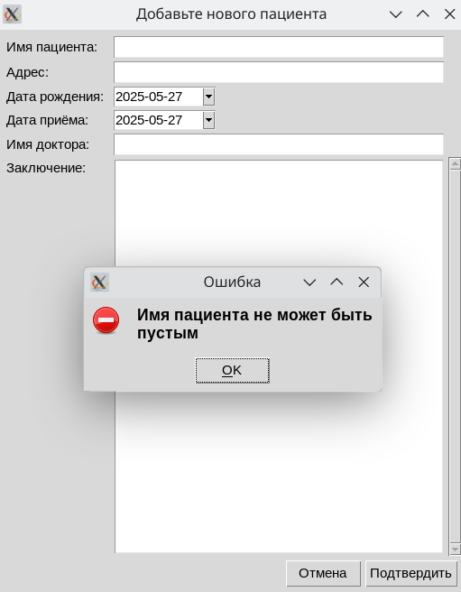

# Система учёта пациентов

Система позволяет обрабатывать и представлять в удобном формате данные о пациентах.

---

## Архитектура приложения

### Модель

Отвечает за данные и бизнес-логику.  
Включает классы для хранения данных о пациентах (ФИО, дата рождения, адрес, имя врача и т.д.).

Реализует методы для:  
- добавления, удаления и поиска записей;  
- сохранения и загрузки данных в/из XML-файла;  
- валидации данных.  

### Контроллер

Управляет взаимодействием между Моделью и Интерфейсом.  
Обрабатывает пользовательский ввод и ошибки, произошедшие во время выполнения программы.

### Представление

Отвечает за отображение данных пользователю и обработку пользовательского ввода.  

Включает:  
- Главное окно для отображения текущего массива записей.  
- Диалоговые окна для:  
  - добавления новой записи;  
  - поиска записей;  
  - удаления записей;  
  - сохранения данных;  
  - загрузки данных.  
  
---  

## Сценарии демонстрации

### Основные сценарии

#### 1. Добавление нового пациента
**Шаги:**
1. Главное окно -> кнопка "Добавить"
2. Заполнить все поля в диалоговом окне
3. Нажать "Сохранить"

**Ожидаемый результат:**
- Новая запись появляется в таблице
- Системное сообщение об успешном добавлении

#### 2. Поиск студентов
**Варианты поиска:**
- По ФИО
- По дата рождения
- По адрес
- По дата приёма
- По Имя врача

**Шаги:**
1. Главное окно -> кнопка "Поиск"
2. Выбрать критерий из выпадающего списка
3. Ввести значение для поиска
4. Нажать "Найти"

#### 3. Удаление студентов
**Шаги:**
1. Главное окно -> кнопка "Удалить"
2. Выбрать критерий удаления
3. Ввести значение
4. Подтвердить удаление

### Работа с файлами

#### 1. Сохранение данных
**Шаги:**
1. Главное окно -> кнопка "Сохранить"

При необходимости:
2. Выбрать место сохранения
3. Указать имя файла (например, "pacient.xml")
4. Подтвердить сохранение

#### 2. Загрузка данных
**Шаги:**
1. Главное окно -> кнопка "Загрузить"
2. Выбрать XML-файл с данными
3. Подтвердить открытие

### Дополнительные сценарии

**Примеры ошибочных сценариев:**
1. Попытка добавить пациента с пустым полем:
   

---

# Система управления записями пациентов

Приложение для управления медицинскими записями пациентов с графическим интерфейсом на базе Tkinter.

## Описание классов

### Patient
Класс, представляющий данные о пациенте.

**Атрибуты**:  
- `_patient_name`: ФИО пациента
- `_address`: Адрес проживания пациента
- `_birth_date`: Дата рождения пациента
- `_appointment_date`: Дата приёма
- `_doctor_name`: ФИО врача
- `_conclusion`: Заключение врача

**Методы**:  
- Геттеры для всех атрибутов (`patient_name`, `address`, `birth_date`, `appointment_date`, `doctor_name`, `conclusion`)
- `__str__`: Возвращает строковое представление данных пациента

---

### DialogBase
Базовый класс для всех диалоговых окон приложения.

**Атрибуты**:
- `parent`: Родительское окно
- `title`: Заголовок диалогового окна

**Методы**:
- `create_date_entry`: Создает виджет для ввода даты
- `create_form_field`: Создает поле формы с меткой
- `show_error`: Показывает сообщение об ошибке
- `show_message`: Показывает информационное сообщение
- `show_confirm`: Показывает диалог подтверждения

---

### AddRecordDialog
Диалоговое окно для добавления новой записи пациента.

**Атрибуты**:
- `patient_name`: Поле ввода ФИО пациента
- `address`: Поле ввода адреса
- `birth_date`: Поле выбора даты рождения
- `appointment_date`: Поле выбора даты приёма
- `doctor_name`: Поле ввода ФИО врача
- `conclusion`: Текстовое поле для заключения

**Методы**:
- `_on_submit`: Проверяет и отправляет данные формы
  - Проверяет заполнение всех обязательных полей
  - Показывает сообщения об ошибках на русском языке
  - Отправляет данные в контроллер

---

### SearchDialog
Диалоговое окно для поиска записей пациентов.

**Атрибуты**:
- Поля для критериев поиска (аналогичны AddRecordDialog)
- `tree`: Таблица для отображения результатов
- Флаги учёта дат при поиске

**Методы**:
- `_clear_form`: Очищает все поля формы
- `_on_search`: Выполняет поиск по заданным критериям
  - Собирает критерии поиска
  - Отображает результаты в таблице

---

### DeleteDialog
Диалоговое окно для удаления записей.

**Атрибуты**:
- Поля для критериев удаления (аналогичны SearchDialog)
- Флаги учёта дат при удалении

**Методы**:
- `_on_delete`: Выполняет удаление записей
  - Проверяет наличие хотя бы одного критерия
  - Запрашивает подтверждение
  - Показывает результат операции

---

### XMLHandler
Обработчик XML-файлов для хранения данных.

**Методы**:
- `save_records`: Сохраняет записи в XML-файл
- `load_records`: Загружает записи из XML-файла
- `_create_record_element`: Создаёт XML-элемент для записи
- `_parse_record_element`: Разбирает XML-элемент в объект записи

---

## Использование

1. Запустите приложение через main.py
2. Используйте меню или панель инструментов для:
   - Добавления новых записей
   - Поиска существующих записей
   - Удаления записей
   - Сохранения/загрузки данных в XML
